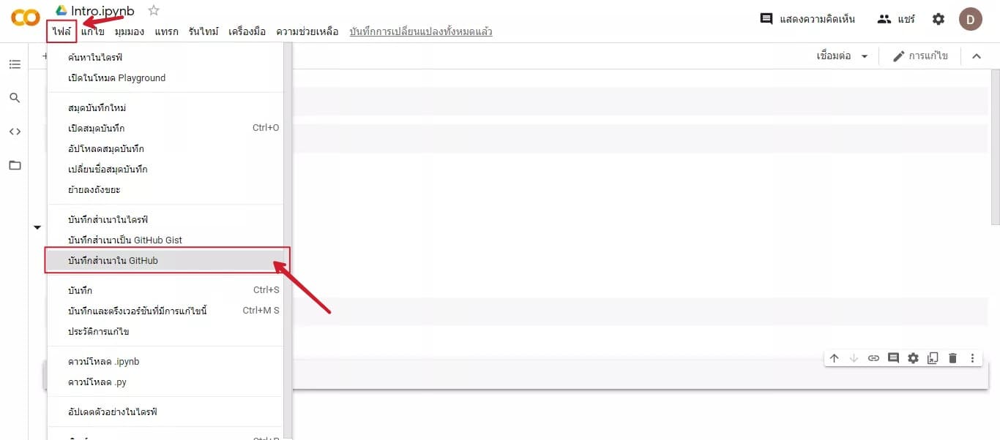

# data_viz
#ดรุณรัตน์ ราชแข็ง 613020968-5

ตัวอย่างการแทรกรูปภาพ

HW1 การบันทึกไฟล์จาก Google colab ไปยัง Github

1.เข้าGoogle colab หลังจากนั้นคลิกไปที่ "ไฟล์" แล้วเลือก "บันทึกสำเนาใน GitHub"

2.เมื่อคลิก "บันทึกสำเนาใน Github" แล้วจะได้ตามดังรูป หลังจากนั้นให้พิมพ์ "frist python commit" ที่ข้อความคอมมิต แล้วกดตกลง

3.เมื่อกดดตกลง Github จะเปิดหน้าที่เราทำใน Google colab บนหน้าต่างของ Github ดังรูป

